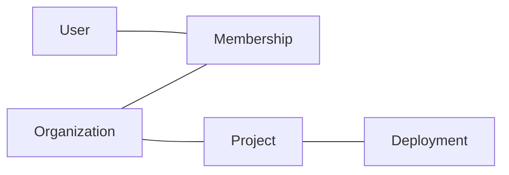

This page documents the primary domain entities. For schema definitions, see the migration files in the `mintlify/core` repo.

## Core entities

### User

Represents an authenticated person. One user can belong to multiple organizations.

| Field | Type | Description |
|-------|------|-------------|
| `id` | UUID | Primary key |
| `email` | string | Unique, used for login and GitHub OAuth |
| `created_at` | timestamp | Account creation time |
| `last_login_at` | timestamp | Last successful authentication |

### Organization

A company or team account. The primary billing and access control boundary.

| Field | Type | Description |
|-------|------|-------------|
| `id` | UUID | Primary key |
| `name` | string | Display name |
| `plan` | enum | `starter`, `growth`, `enterprise` |
| `owner_id` | FK → User | Billing owner |

### Project

A Mintlify documentation project connected to a Git repository.

| Field | Type | Description |
|-------|------|-------------|
| `id` | UUID | Primary key |
| `org_id` | FK → Organization | Owning organization |
| `repo_url` | string | Connected GitHub or GitLab repository |
| `subdomain` | string | `*.mintlify.app` subdomain |
| `custom_domain` | string | Optional custom domain |
| `created_at` | timestamp | |

### Deployment

A single build of a Project, triggered by a Git push or PR event.

| Field | Type | Description |
|-------|------|-------------|
| `id` | UUID | Primary key |
| `project_id` | FK → Project | |
| `commit_sha` | string | Git commit that triggered the build |
| `status` | enum | `queued`, `building`, `success`, `failed` |
| `is_production` | boolean | Whether this is the live production deployment |
| `built_at` | timestamp | |

## Relationships

A User can be a member of many Organizations. An Organization can have many Projects. Each Project has many Deployments, with one marked as production.

## Data storage

| Data type | Storage | Notes |
|-----------|---------|-------|
| Relational data | Postgres | Primary store, owned by Core API |
| Sessions | Redis | TTL-based, auto-expire |
| Built docs assets | S3 | Referenced by URL, served via Cloudflare CDN |
| Search index | Mintlify search service | Synced from docs content via Build Worker |

## Sensitive fields

The following must never appear in logs or be returned in API responses:

- OAuth tokens from GitHub and GitLab integrations
- Customer API keys
- Payment method tokens (stored in Stripe, referenced by ID only)

If you're adding a field that contains credentials or PII, flag it in your PR for review.
