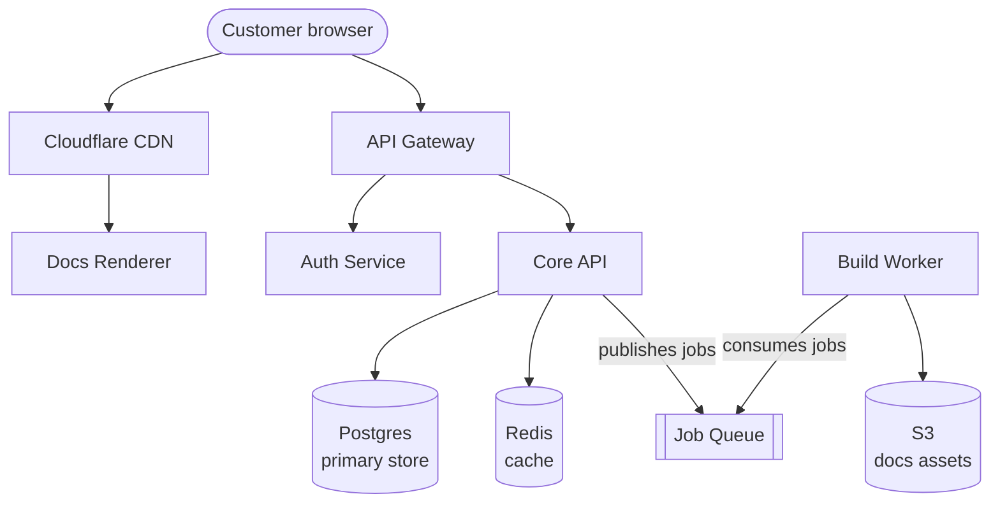

This page gives a high-level map of Mintlify's backend services. Each service has its own README with deeper documentation.

## Service map

## Services

### Docs Renderer

Serves customer docs sites at `*.mintlify.app` and custom domains. Fetches built docs assets from S3 and renders them server-side. Deployed on Vercel with Cloudflare in front for CDN caching.

**Repo:** `mintlify/web`

### API Gateway

The public-facing API entry point. Handles routing, rate limiting, and authentication before forwarding requests to downstream services.

**Repo:** `mintlify/api`

### Auth Service

Manages user identity, sessions, and organization memberships. Handles GitHub and GitLab OAuth flows, SSO via SAML, and JWT generation.

**Repo:** `mintlify/auth`

### Core API

The main application backend. Handles business logic for projects, deployments, analytics, and billing integration. Owns the primary Postgres database.

**Repo:** `mintlify/core`

### Build Worker

Processes documentation builds: clones repos, runs the Mintlify build pipeline, and uploads output to S3. Triggered by GitHub webhook pushes and PR events.

**Repo:** `mintlify/worker`

## Communication patterns

- **Synchronous** — Services communicate via internal HTTP APIs. Auth tokens are validated at each service boundary.
- **Asynchronous** — The Build Worker consumes jobs from a queue. The Core API enqueues build jobs when a push or PR event arrives.
- **CDN** — Docs assets are served from Cloudflare edge nodes globally, with S3 as the origin.

## Environments

| Environment | Purpose | Access |
|-------------|---------|--------|
| Local | Development | All engineers |
| Preview | PR review | All engineers |
| Production | Live customer traffic | Deploy tool only |
